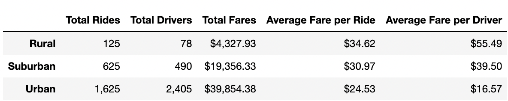

# Pyber_Analysis

## Overview of the analysis

The company V. Isualize has asked that I create a summary DataFrame of the ride-sharing data by city type. Then, using Pandas and Matplotlib, I'll create a multiple-line graph that shows the total weekly fares for each city type. They are interested in seeing how the data differs by city type and how those differences can be used by Pyber 

## Results

From analysis of the data: 
1. Rural cities have the lowest total drivers. Urban cities have the highest.
2. Rural cities have the lowest total rides. Urban cities have the highest.
3. Rural cities have the highest average fare per driver but the lowest total fares. 
4. The more drivers and rides, the higher total fares are. 

The image above summarizes these differences between the different city types. 

## Summary

Based on my analysis, I would suggest that Pyber:

1. Increase the number of drivers in rural cities, because they have a higher average fare per driver and rides.
2. Offer incentives to rural city riders, because affordability in rural cities is low but they have the highest value (based on average fare per driver and rides).
3. Do further research into why rural cities cost more per driver/ride? Is it because of the distance? Is it because lack of drivers? This will help to understand the reason behind their higher cost. 
